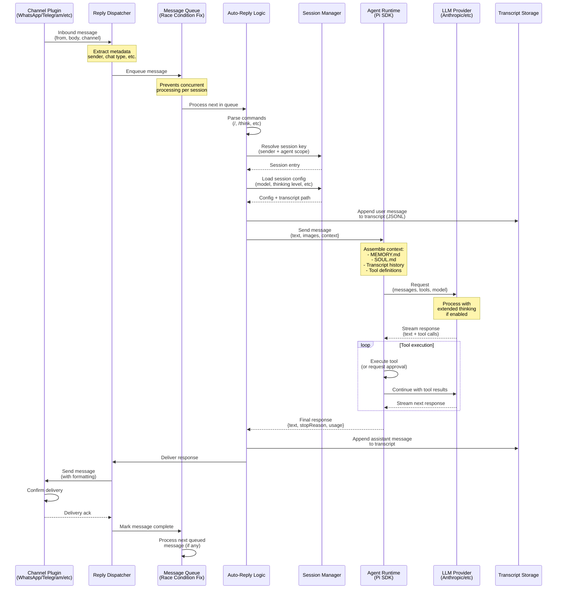
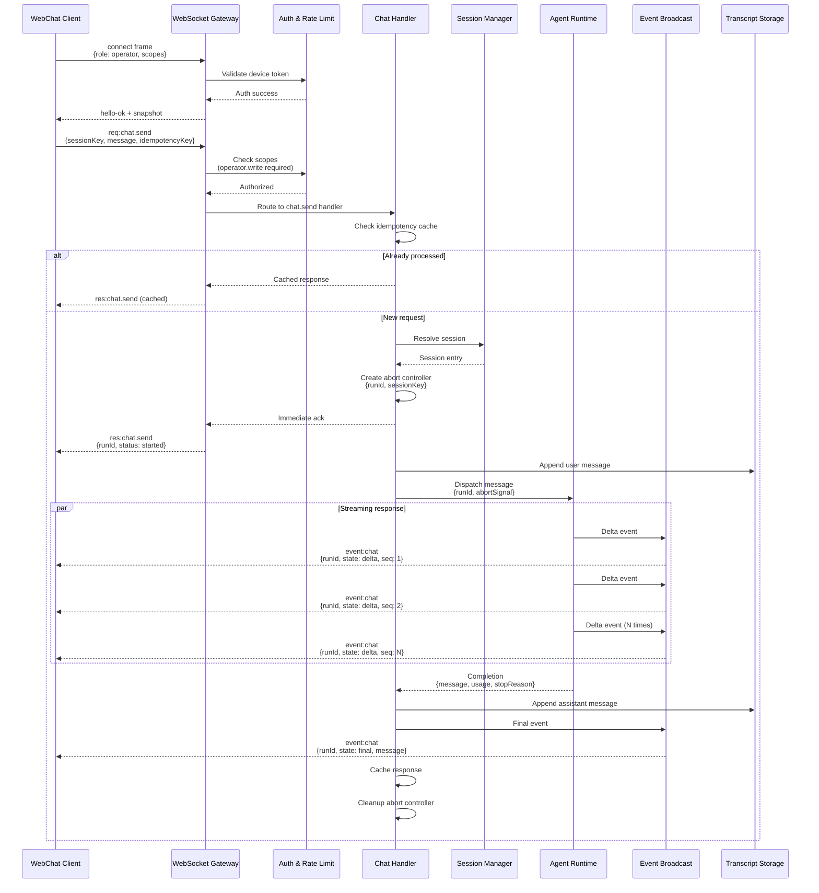
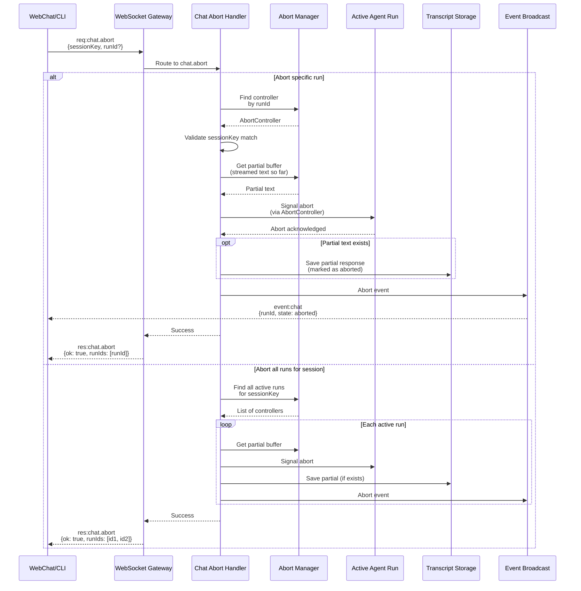
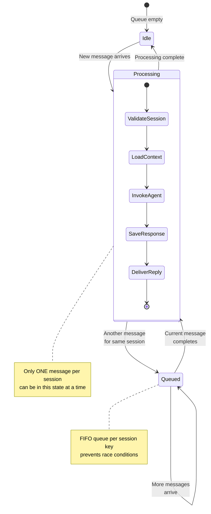

# Message Flow Architecture

**Last Updated:** 2026-02-16
**Status:** Current (OpenClaw Fork)

## Overview

This document illustrates how messages flow through the OpenClaw Gateway system, from inbound channel messages through agent processing to outbound delivery.

## Inbound Message Flow (Channel → Agent)



## WebSocket Chat Flow (WebChat → Agent)



## Chat Abort Flow



## Channel Reply Flow (Agent → Channel)

```mermaid
graph TB
    subgraph "Agent Completion"
        AgentDone[Agent completes response]
        ReplyCtx[Build reply context]
    end

    subgraph "Reply Dispatcher"
        Prefix[Apply prefix logic<br/>model indicator, emoji]
        Format[Format for channel<br/>markdown/HTML/plain]
        Split[Split long messages<br/>channel limits]
    end

    subgraph "Delivery Logic"
        Policy{Send Policy?}
        Queue[Enqueue for delivery]
        Retry[Retry logic<br/>exponential backoff]
    end

    subgraph "Channel Plugin"
        Send[Send via channel API]
        Confirm[Wait for confirmation]
        Error[Handle delivery error]
    end

    subgraph "Error Handling"
        Log[Log error]
        Notify[Notify user<br/>(if possible)]
        Fallback{Fallback channel?}
    end

    AgentDone --> ReplyCtx
    ReplyCtx --> Prefix
    Prefix --> Format
    Format --> Split
    Split --> Policy

    Policy -->|allow| Queue
    Policy -->|deny| Log

    Queue --> Send
    Send --> Confirm
    Send --> Error

    Confirm --> Done[✓ Delivered]

    Error --> Log
    Log --> Retry
    Retry -->|attempts left| Queue
    Retry -->|max attempts| Fallback

    Fallback -->|yes| AltChannel[Try alternate channel]
    Fallback -->|no| Notify

    AltChannel --> Send

    %% Styling
    classDef agent fill:#e8f5e9,stroke:#388e3c,stroke-width:2px
    classDef dispatcher fill:#fff3e0,stroke:#f57c00,stroke-width:2px
    classDef delivery fill:#e1f5ff,stroke:#0288d1,stroke-width:2px
    classDef channel fill:#f3e5f5,stroke:#7b1fa2,stroke-width:2px
    classDef error fill:#ffebee,stroke:#c62828,stroke-width:2px

    class AgentDone,ReplyCtx agent
    class Prefix,Format,Split dispatcher
    class Policy,Queue,Retry delivery
    class Send,Confirm channel
    class Error,Log,Notify,Fallback error
```

## Message Queue (Race Condition Prevention)

The message queue prevents concurrent processing of messages for the same session, which was causing WhatsApp race conditions in the original OpenClaw.



## Key Patterns

### 1. Idempotency

- All side-effecting operations require idempotency keys
- Gateway maintains short-lived cache (dedupe map)
- Prevents duplicate agent invocations on retry

### 2. Streaming

- WebSocket clients receive real-time deltas
- Channel plugins receive final message only
- Sequence numbers ensure correct ordering

### 3. Race Condition Prevention

- One message per session processed at a time
- Queue-based serialization
- Prevents conflicting transcript writes

### 4. Graceful Degradation

- Channel failures don't crash gateway
- Partial responses saved on abort
- Fallback delivery mechanisms

### 5. Multi-Channel Routing

- Single session can route to multiple channels
- Channel-specific formatting applied
- Delivery confirmation tracking

## Performance Considerations

### Latency Sources

1. **Channel → Queue**: < 10ms (in-memory)
2. **Queue → Agent**: < 50ms (context assembly)
3. **Agent → LLM**: 500-5000ms (network + inference)
4. **LLM streaming**: 50-200ms per token
5. **Reply → Channel**: 100-500ms (API latency)

### Optimizations

- **Token caching**: Reduces LLM API costs
- **Transcript compaction**: Limits context size
- **Parallel tool execution**: Multiple tools at once
- **Connection pooling**: Reuse HTTP connections

## Related Documents

- [System Architecture](system-architecture.md)
- [Security Architecture](security-architecture.md)
- [WhatsApp Race Condition Fix (ADR-02)](ARCHITECTURE_DECISIONS.md#adr-02)
