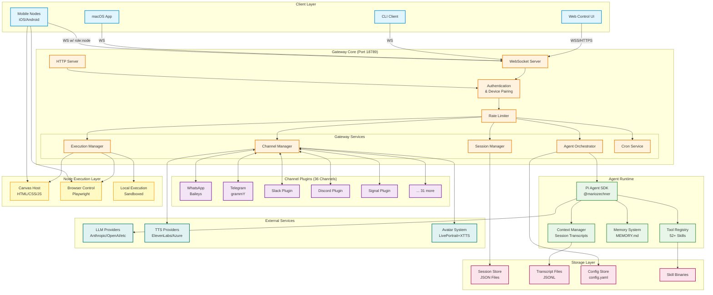

# System Architecture

**Last Updated:** 2026-02-16
**Status:** Current (OpenClaw Fork)

## Overview

This document describes the overall system architecture of the OpenClaw Gateway, illustrating the major components and their interactions.

## High-Level Architecture

## Component Descriptions

### Client Layer

- **Web Control UI**: Browser-based interface for system management and chat
- **CLI Client**: Command-line interface for operations and automation
- **macOS App**: Native desktop application
- **Mobile Nodes**: iOS/Android devices with execution capabilities

### Gateway Core

#### WebSocket Server

- Handles persistent connections from clients and nodes
- Protocol version 3
- Bidirectional RPC with request/response/event frames
- Supports multiple concurrent connections

#### HTTP Server

- Serves Control UI assets
- Canvas Host endpoints (`/__openclaw__/canvas/`, `/__openclaw__/a2ui/`)
- Optional OpenAI Chat Completions endpoint (`/v1/chat/completions`)
- Optional OpenResponses API endpoint (`/v1/responses`)

#### Authentication & Device Pairing

- Device-based authentication with token rotation
- Tailscale network identity support
- Role-based access control (operator vs node)
- Scope-based permissions (admin, read, write, approvals, pairing)

#### Rate Limiter

- Prevents authentication abuse
- Configurable limits per client/device

### Gateway Services

#### Channel Manager

- Manages 36+ channel plugin connections
- Routes messages between channels and agents
- Handles delivery confirmations and errors
- Reply dispatcher with queue-based race condition prevention

#### Session Manager

- Maintains session lifecycle (create, update, reset, delete)
- Session store persistence (JSON files)
- Session key resolution and routing
- Label and metadata management

#### Agent Orchestrator

- Coordinates agent execution via Pi SDK
- Model selection and provider routing
- Context assembly from transcripts and memory
- Subagent spawning and management

#### Execution Manager

- Tool execution approval workflows
- Sandbox security enforcement
- Remote execution on paired nodes
- Timeout and resource limits

#### Cron Service

- Scheduled task management
- Recurring message/command execution
- Run history tracking

### Channel Plugins

36 integrated channels including:

- **WhatsApp** (Baileys library)
- **Telegram** (grammY framework)
- **Slack, Discord, Signal**
- 31 additional channels

### Agent Runtime

#### Pi Agent SDK

- Core agent framework by @mariozechner
- Tool execution interface
- Stream handling for incremental responses
- Session management

#### Tool Registry

- 52+ built-in skills/tools
- Dynamic skill loading
- Remote skill execution on nodes
- Binary caching

#### Memory System

- Persistent memory in `MEMORY.md`
- Agent identity and personality
- Bootstrap files (SOUL.md, IDENTITY.md, TOOLS.md)

#### Context Manager

- Transcript assembly (JSONL format)
- Message history with parent chains
- Token counting and compaction
- Cache management

### Storage Layer

- **Session Store**: JSON-based session metadata
- **Transcripts**: JSONL files per session
- **Config Store**: YAML configuration
- **Skill Binaries**: Cached executables

### External Services

- **LLM Providers**: Anthropic, OpenAI, Google, etc.
- **TTS Providers**: ElevenLabs, Azure Cognitive Services
- **Avatar System**: LivePortrait + XTTS for realistic avatars

### Node Execution Layer

- **Canvas Host**: Agent-editable HTML/CSS/JS pages
- **Browser Control**: Playwright-based automation
- **Local Execution**: Sandboxed command execution

## Key Characteristics

### Scalability

- Currently: **Modular Monolith** (single process)
- Future: Migration path to microservices via Event Bus decoupling

### Security

- Multi-layer sandbox for tool execution
- Credential redaction in logs and storage
- Device pairing with approval workflows
- Rate limiting on authentication

### Reliability

- Message queue prevents WhatsApp race conditions
- Idempotent request handling
- Graceful degradation on channel failures
- Kill switch for emergency shutdown

### Performance

- WebSocket for low-latency bidirectional communication
- Streaming responses for real-time feedback
- Token caching for reduced API costs
- Efficient JSONL-based transcript storage

## Protocol Version

**Current Version**: 3

See [Gateway Protocol Documentation](/docs/concepts/architecture.md) for wire protocol details.

## Related Documents

- [Message Flow Architecture](message-flow.md)
- [Security Architecture](security-architecture.md)
- [Gateway Architecture](/docs/concepts/architecture.md)
- [Architecture Decision Records](ARCHITECTURE_DECISIONS.md)
