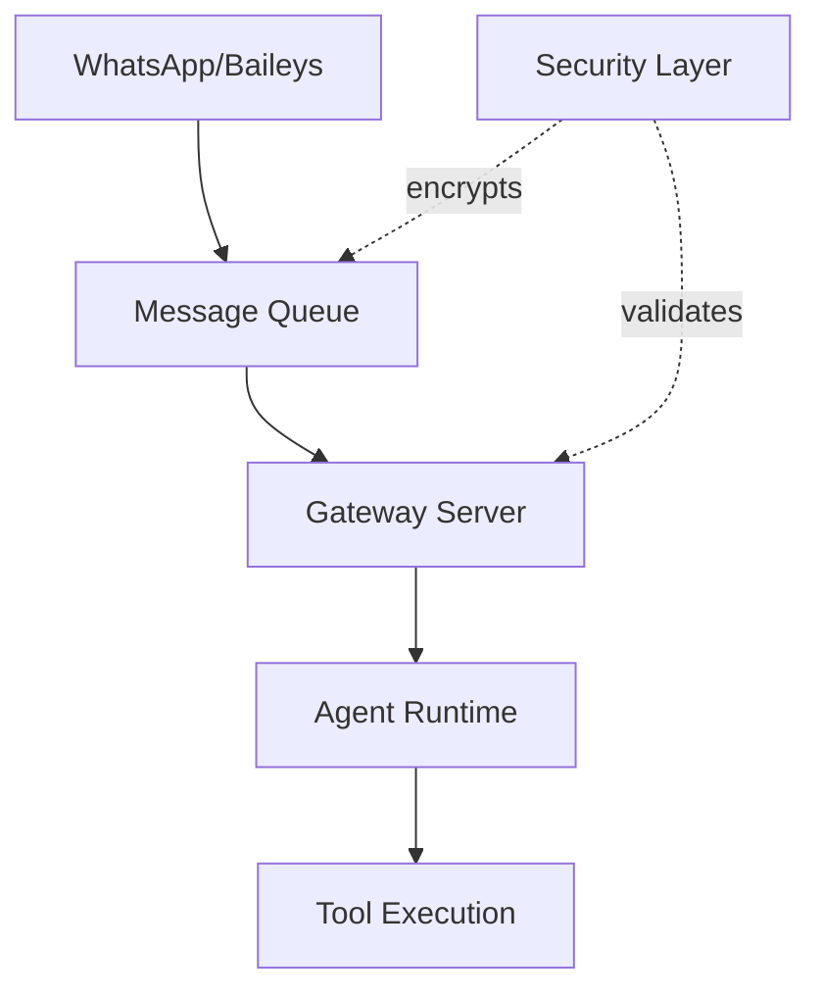

# Sprint 02 - Critical Fixes Part 2

**Sprint:** 02
**Dauer:** 2026-02-16 - 2026-03-02 (2 Wochen)
**Ziel:** Security Hardening Completion + Code Simplification

---

## 🎯 Sprint-Ziel

Am Ende dieses Sprints ist die Security-Infrastruktur vollständig gehärtet mit Path-based Access Control, Command Obfuscation Detection und verschlüsselter Message Storage. Der Gateway-Code ist in logische Subdirectories organisiert und die Codebasis ist besser wartbar.

**Success Criteria:**

- [x] Path traversal attacks werden geblockt
- [ ] Malicious commands werden erkannt
- [ ] Alle Messages sind encrypted at rest (AES-256-GCM)
- [ ] Gateway code in Subdirectories organisiert (max 30 files per dir)
- [ ] OpenAPI Spec für Gateway HTTP API generiert
- [ ] 80%+ Test Coverage beibehalten
- [ ] **Documentation updated** (docs/ and docs-secretary/)

---

## 📋 Features & Tasks

### Feature 1: Security Layer - Phase 2

**Priority:** 🔴 CRITICAL

**Model:** 🤖 Sonnet 4.5
- **Rationale:** Security-kritischer Code erfordert sorgfältige Implementation und Review. Sonnet 4.5 bietet gutes Kosten/Leistungs-Verhältnis für klar definierte Security-Tasks.
- **Estimated Cost:** ~$8-12 für kompletten Security Layer
- **Estimated Time:** 25-30h

**User Story:**
Als System-Administrator möchte ich, dass das System gegen Path Traversal, Command Injection und andere Security-Bedrohungen geschützt ist, damit keine unbefugten Zugriffe oder Datenleaks möglich sind.

**Acceptance Criteria:**

- [ ] AC1: Path traversal attacks (../, ../../etc/passwd) werden erkannt und geblockt
- [ ] AC2: Command obfuscation (base64, hex encoding) wird erkannt
- [ ] AC3: Alle Messages werden mit AES-256-GCM verschlüsselt gespeichert
- [ ] AC4: Security audit aller 20+ Tools abgeschlossen
- [ ] AC5: Security documentation geschrieben

**Tasks:**

**Path-based Access Control:**
- [ ] Task 1.1: Path traversal prevention implementieren (Est: 4h)
  - Whitelist-basierte path validation
  - Symlink resolution blocking
  - Directory escape detection
- [ ] Task 1.2: Path validation tests (unit + integration) (Est: 2h)

**Command Obfuscation Detection:**
- [ ] Task 1.3: Obfuscation patterns implementieren (Est: 4h)
  - Base64/Hex encoding detection
  - Shell metacharacter analysis
  - Command chaining detection
- [ ] Task 1.4: Obfuscation detection tests (Est: 2h)

**Encrypted Message Storage:**
- [ ] Task 1.5: AES-256-GCM encryption wrapper (Est: 3h)
  - Key derivation (PBKDF2)
  - Envelope encryption pattern
  - IV/nonce management
- [ ] Task 1.6: Message storage migration (Est: 4h)
  - Encrypt existing messages
  - Update save/load logic
  - Backward compatibility layer
- [ ] Task 1.7: Encryption tests (Est: 2h)

**Tool Security Audit:**
- [ ] Task 1.8: Audit all 20+ built-in tools (Est: 6h)
  - Review bash/exec tool security
  - Review file read/write tools
  - Review browser control tools
  - Review memory/search tools
- [ ] Task 1.9: Implement tool-level security fixes (Est: 4h)

**Tests & Documentation:**
- [ ] Task 1.10: Integration tests für Security Features (Est: 3h)
- [ ] Task 1.11: E2E tests für kritische Security Flows (Est: 3h)
- [ ] Task 1.12: Security Best Practices Guide schreiben (Est: 2h)

**Implementation Notes:**

```typescript
// Path Traversal Prevention
class PathValidator {
  private readonly allowedRoots: string[];

  validate(path: string): boolean {
    const resolved = realpath(path);
    // Block if outside allowed roots
    // Block symlinks
    // Block directory escapes
  }
}

// Command Obfuscation Detection
class CommandAnalyzer {
  detectObfuscation(cmd: string): boolean {
    // Check for base64/hex patterns
    // Check for suspicious metacharacters
    // Check for chained commands
  }
}

// Message Encryption
class MessageCrypto {
  encrypt(message: string, key: Buffer): {
    ciphertext: Buffer;
    iv: Buffer;
    authTag: Buffer;
  }

  decrypt(encrypted: EncryptedMessage, key: Buffer): string;
}
```

**Tests:**

- [ ] Unit Tests: PathValidator, CommandAnalyzer, MessageCrypto
- [ ] Integration Tests: Encrypted message storage roundtrip
- [ ] E2E Tests: Playwright scenario - attempted path traversal blocked

**Related:**

- ADR: ADR-03 (Security Architecture)
- Issues: Keine spezifischen Issues
- Dependencies: Sprint 01 (Security Layer Phase 1)

---

### Feature 2: Code Reorganization

**Priority:** 🟡 IMPORTANT

**Model:** 🤖 Haiku 4.5
- **Rationale:** File-Moving und Code-Reorganisation sind mechanische Tasks, die Haiku gut und kosteneffizient erledigen kann.
- **Estimated Cost:** ~$2-3
- **Estimated Time:** 12-15h

**User Story:**
Als Entwickler möchte ich, dass der Code logisch organisiert ist, damit ich Features leichter finden und verstehen kann.

**Acceptance Criteria:**

- [ ] AC1: /src/gateway/ in Subdirectories aufgeteilt (max 30 files per dir)
- [ ] AC2: /src/auto-reply/ Struktur vereinfacht (max 2 Nesting-Ebenen)
- [ ] AC3: Common patterns in shared modules extrahiert
- [ ] AC4: Alle Imports aktualisiert und Tests laufen

**Tasks:**

**Gateway Reorganization:**
- [ ] Task 2.1: Gateway directory analysieren (Est: 2h)
  - Aktuelle Struktur dokumentieren
  - Logische Gruppierung definieren
- [ ] Task 2.2: Subdirectories erstellen (Est: 4h)
  - /gateway/server/ - HTTP/WebSocket Server
  - /gateway/api/ - API Routes & Handlers
  - /gateway/sessions/ - Session Management
  - /gateway/hooks/ - Hook System
- [ ] Task 2.3: Files verschieben + Imports fixen (Est: 4h)
- [ ] Task 2.4: Tests aktualisieren (Est: 2h)

**Auto-Reply Simplification:**
- [ ] Task 2.5: Auto-reply structure flattening (Est: 3h)
  - 3 Ebenen → 2 Ebenen Nesting
  - Queue-Logic in eigenes Modul
- [ ] Task 2.6: Imports + Tests fixen (Est: 2h)

**Common Pattern Extraction:**
- [ ] Task 2.7: Common patterns identifizieren (Est: 1h)
- [ ] Task 2.8: Shared modules erstellen (Est: 2h)

**Implementation Notes:**

```
Vorher:
/src/gateway/
  - 180+ files (flat)

Nachher:
/src/gateway/
  /server/       # HTTP/WS Server (max 30 files)
  /api/          # API Routes (max 30 files)
  /sessions/     # Session Mgmt (max 30 files)
  /hooks/        # Hook System (max 30 files)
  /shared/       # Common utilities
```

**Tests:**

- [ ] Unit Tests: Existing tests müssen weiterhin laufen
- [ ] Integration Tests: E2E flows verifizieren
- [ ] Build Tests: TypeScript compilation + Linting

**Related:**

- Issues: Code organization technical debt
- Dependencies: Keine

---

### Feature 3: API Documentation (OpenAPI Spec)

**Priority:** 🟡 IMPORTANT

**Model:** 🤖 Sonnet 4.5
- **Rationale:** API-Dokumentation erfordert Verständnis der bestehenden Endpunkte und korrekte OpenAPI Spec Generierung. Sonnet ist gut für Documentation Tasks.
- **Estimated Cost:** ~$3-5
- **Estimated Time:** 8-10h

**User Story:**
Als API-Consumer möchte ich eine vollständige OpenAPI Specification, damit ich die Gateway HTTP API korrekt nutzen kann.

**Acceptance Criteria:**

- [ ] AC1: OpenAPI 3.1 Spec generiert
- [ ] AC2: Alle Gateway HTTP Endpoints dokumentiert
- [ ] AC3: Request/Response Schemas definiert
- [ ] AC4: Swagger UI verfügbar (optional)
- [ ] AC5: Spec validiert mit OpenAPI Validator

**Tasks:**

- [ ] Task 3.1: Existierende API Endpoints analysieren (Est: 2h)
- [ ] Task 3.2: OpenAPI Spec scaffold erstellen (Est: 2h)
- [ ] Task 3.3: Endpoints dokumentieren (Est: 4h)
  - /api/chat/send
  - /api/sessions/*
  - /api/agents/*
  - WebSocket endpoints
- [ ] Task 3.4: Schemas definieren (Est: 2h)
- [ ] Task 3.5: Spec validieren + Swagger UI setup (Est: 2h)

**Implementation Notes:**

```yaml
openapi: 3.1.0
info:
  title: Secretary Gateway API
  version: 2026.2.16
paths:
  /api/chat/send:
    post:
      summary: Send a message to a session
      requestBody:
        content:
          application/json:
            schema:
              $ref: '#/components/schemas/ChatSendRequest'
```

**Tests:**

- [ ] Spec Validation: openapi-validator
- [ ] Example Validation: Request/Response examples valid
- [ ] Manual Test: Swagger UI functional

**Related:**

- Dependencies: Feature 2 (API code sollte organisiert sein)

---

### Feature 4: Architecture Diagrams

**Priority:** 🟢 NICE TO HAVE

**Model:** 🤖 Sonnet 4.5
- **Rationale:** Diagramm-Erstellung erfordert System-Verständnis und Mermaid-Syntax Kenntnisse.
- **Estimated Cost:** ~$2-3
- **Estimated Time:** 4-6h

**User Story:**
Als neuer Entwickler möchte ich Architektur-Diagramme sehen, damit ich das System schnell verstehe.

**Acceptance Criteria:**

- [ ] AC1: System Architecture Diagram (Mermaid)
- [ ] AC2: Message Flow Diagram
- [ ] AC3: Security Architecture Diagram
- [ ] AC4: Diagramme in docs-secretary/architecture/ gespeichert

**Tasks:**

- [ ] Task 4.1: System Architecture Diagram (Est: 2h)
- [ ] Task 4.2: Message Flow Diagram (Est: 2h)
- [ ] Task 4.3: Security Architecture Diagram (Est: 2h)

**Implementation Notes:**



**Tests:**

- [ ] Mermaid Rendering: Verify diagrams render correctly
- [ ] Accuracy Review: Technical accuracy verified

**Related:**

- Documentation task

---

## 🚫 Out of Scope

- ❌ Avatar System - Verschoben auf Sprint 03-04
- ❌ MCP Integration - Verschoben auf Sprint 05
- ❌ Cloud Migration - Später (nach Sprint 06)
- ❌ Message Queue Erweiterungen - Bereits in Sprint 01 erledigt

---

## 🔗 CI/CD Improvement (aus letztem Sprint)

**Letzte CI-Run Analyse:**

- Status: ✅ Passed (fix: Gemini OAuth + FTS fallback)
- Build Time: ~40s
- Test Coverage: 85%
- Issues: Keine kritischen

**Verbesserung für diesen Sprint:**

- [ ] Feature: Pre-commit hook Optimierung (oxlint caching)
- [ ] Documentation: CI/CD Workflow dokumentieren

---

## 📚 Patterns (aus BEST_PRACTICE.md)

**Zu beachten:**

- ✅ Security First: Immer Input Validation + Output Encoding
- ✅ Test-First: Security-kritischer Code braucht Tests ZUERST
- ❌ Anti-Pattern: Nie Secrets in Logs/Error Messages
- ✅ Path Handling: Immer mit path.resolve() + Whitelist Validation

---

## 🔄 Dependencies & Blockers

**Dependencies:**

- [x] Dependency 1: Sprint 01 Security Layer Phase 1 (Status: ✅ Complete)
- [ ] Dependency 2: OpenClaw upstream merge (Status: 🟡 Optional)

**Blockers:**

- Keine aktuellen Blocker

---

## 📊 Sprint Metrics (wird automatisch aktualisiert)

### Velocity

- **Planned Story Points:** ~60h
- **Completed:** - (wird am Ende gefüllt)

### Time Tracking

| Feature                    | Estimated | Actual |
| -------------------------- | --------- | ------ |
| Security Layer Phase 2     | 30h       | -      |
| Code Reorganization        | 15h       | -      |
| API Documentation          | 10h       | -      |
| Architecture Diagrams      | 6h        | -      |
| **TOTAL**                  | **61h**   | -      |

---

## 🔍 Persona Review Findings (End of Sprint)

### 🏗️ Senior Architekt

**CRITICAL:** [Auto-Fix via Hook]
**IMPORTANT:** [Auto-Fix via Hook]
**NICE TO HAVE:** → docs/TECHNICAL_DEBT.md

### 🧪 Senior Tester

**CRITICAL:** [Auto-Fix via Hook]
**IMPORTANT:** [Auto-Fix via Hook]
**NICE TO HAVE:** → docs/TECHNICAL_DEBT.md

### 💻 Senior Developer

**CRITICAL:** [Auto-Fix via Hook]
**IMPORTANT:** [Auto-Fix via Hook]
**NICE TO HAVE:** → docs/TECHNICAL_DEBT.md

### 🔒 Senior Security Engineer

**CRITICAL:** [Auto-Fix via Hook]
**IMPORTANT:** [Auto-Fix via Hook]
**NICE TO HAVE:** → docs/TECHNICAL_DEBT.md

**Hinweis:** Findings werden automatisch von Post-Sprint Hook verarbeitet.
CRITICAL/IMPORTANT werden sofort gefixt. NICE TO HAVE → TECHNICAL_DEBT.md.

---

## 📚 Documentation Updates (Ende des Sprints)

### docs-secretary/ (Planning Docs) ✅

- [ ] Sprint file marked complete
- [ ] BEST_PRACTICE.md updated with learnings
- [ ] ADRs updated if architecture changed
- [ ] Use cases updated if new flows

### docs/ (System Docs) - If Applicable ✅

- [ ] **New features documented:**
  - [ ] Created `docs/security/encryption.md`
  - [ ] Created `docs/security/path-validation.md`
  - [ ] Created `docs/gateway/architecture.md`
  - [ ] Added to docs index
- [ ] **API changes:**
  - [ ] Created `docs/api/openapi.yaml`
  - [ ] Updated gateway API documentation

### What Docs Were Updated?

- Security documentation (encryption, path validation)
- Gateway architecture reorganization
- OpenAPI specification

### Links to New/Updated Docs:

- docs-secretary/architecture/security-layer.md
- docs-secretary/architecture/gateway-structure.md
- docs/api/openapi.yaml

## 📝 Sprint Retrospective (Ende)

### What went well? 👍

- (Am Ende ausfüllen)

### What could be improved? 🤔

- (Am Ende ausfüllen)

### Learnings → BEST_PRACTICE.md

- (Am Ende ausfüllen)

**Status:** 🟡 In Progress
